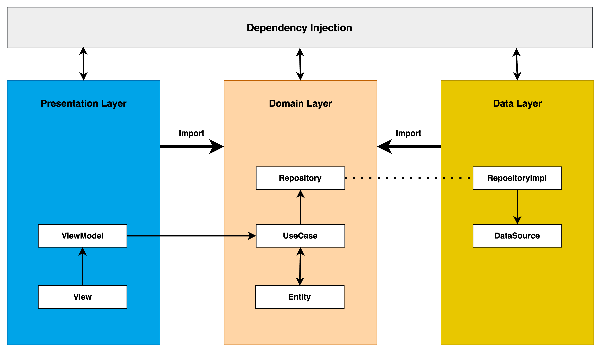

<h1 align="center">DeepMedi</h1>

DeepMedi Android 과제수행

Created by [bmsk](https://github.com/YiBeomSeok)

# Tech stack & Open-source libraries

- **Jetpack**
    - **Lifecycle**
    - [CameraX](https://developer.android.com/training/camerax?hl=ko): 카메라 인식을 위해 사용하였습니다.
    - **ViewModel**
    - **DataBinding**

- [ML Kit](https://developer.android.com/training/camerax/mlkitanalyzer?hl=ko): 얼굴 인식을 위해 사용하였습니다.

- **Clean Architecture**: 핵심 기능들을 모듈로 나누어 제작하였습니다.
    - **Presentation Layer**: MVVM Architecture (View - DataBinding - ViewModel - Model)
    - **Domain**
    - **Data**
    - **Network**

- **Dependency Injection**
    - [Hilt](https://dagger.dev/hilt/)
- **Glide**
- [Retrofit2 & OkHttp3](https://github.com/square/retrofit)

# Architecture

DeepMedi 과제전형을 위한 본 프로젝트는
다음의 [아키텍처 가이드](https://github.com/YiBeomSeok/TIL/blob/main/Android/CleanArchitecture/ForAndroid.md)를
따랐습니다.

